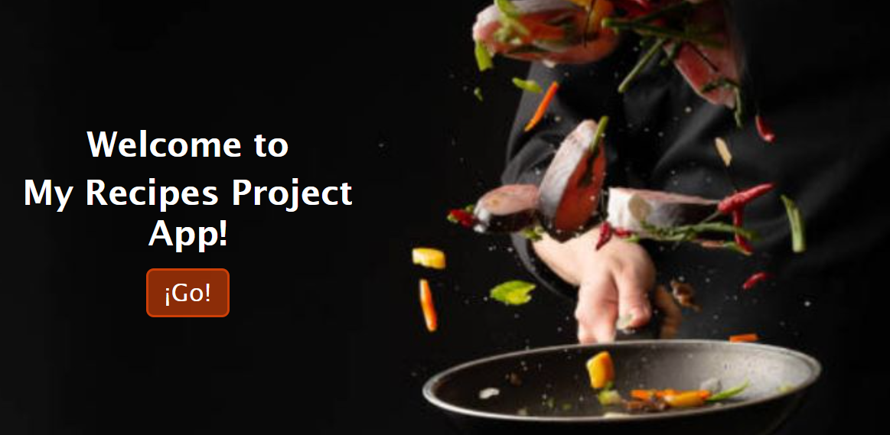
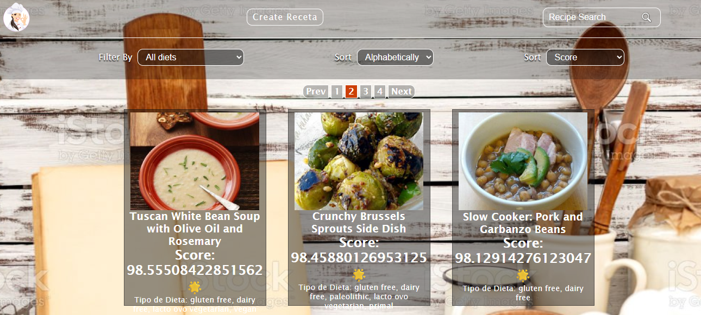
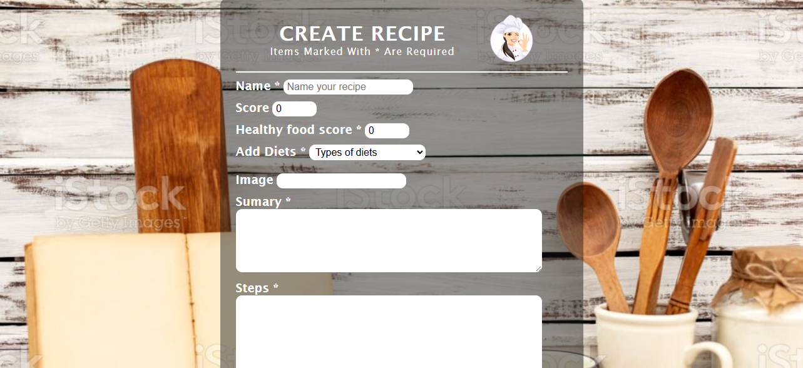

# 🍲 Food Recipes – Frontend (Client)


Aplicación web (SPA) diseñada para explorar el mundo culinario. Este cliente consume la API REST del proyecto para visualizar recetas, aplicar filtros combinados y gestionar la creación de nuevo contenido.
Se enfoca en una experiencia de usuario (UX) fluida y un diseño responsivo.

> **Nota de Arquitectura:** Este repositorio contiene el código del **Frontend**.
> El Backend (API) necesario para su funcionamiento se encuentra aquí:
> 👉 [**Recipes API Repository**](https://github.com/Priscilla-Rojas/Recipes-Api)

<!-- ## 🚀 Despliegue (Deploy)

Puedes ver la aplicación funcionando aquí:
🔗 **[Link a tu deploy en Vercel/Netlify]**
*(Si aún no lo tienes desplegado, puedes borrar esta sección).* -->

## 🖼️ Capturas de Pantalla


*Vista de la Landing Page*


*Vista principal con listado de recetas y paginado*


*Vista del formulario para crear nuevas recetas*

## 🛠️ Tecnologías Utilizadas

El frontend fue construido utilizando las siguientes tecnologías y librerías:

* **React**: Construcción de componentes e interfaz de usuario.
* **Redux**: Manejo del estado global (store) para recetas, filtros y ordenamientos.
* **CSS Modules / Styled Components**: [Aclara aquí qué usaste para los estilos] para el diseño visual.
* **Axios / Fetch**: Para realizar las peticiones HTTP a la API.

## ✨ Funcionalidades

* **Landing Page:** Página de bienvenida con imagen representativa y botón de ingreso.
* **Home:**
    * Visualización de tarjetas de recetas.
    * **Búsqueda:** Barra de búsqueda para encontrar recetas por nombre.
    * **Filtros:** Filtrado por tipo de dieta (Gluten Free, Vegan, etc.) y origen (API o Base de Datos).
    * **Ordenamiento:** Orden alfabético (A-Z, Z-A) y por "Health Score".
    * **Paginado:** Navegación optimizada para ver múltiples recetas.
* **Detalle:** Vista exclusiva con información detallada de la receta (resumen del plato, paso a paso, dietas, score).
* **Formulario de Creación:** Formulario controlado con validaciones en JavaScript para agregar nuevas recetas a la base de datos.

## ⚙️ Instalación y Ejecución Local

Sigue estos pasos para correr el proyecto en tu máquina local:

1.  **Clonar el repositorio:**
    ```bash
    git clone [https://github.com/Priscilla-Rojas/Recipes-Front.git](https://github.com/Priscilla-Rojas/Recipes-Front.git)
    ```

2.  **Instalar dependencias:**
    Navega a la carpeta del proyecto y ejecuta:
    ```bash
    npm install
    ```

3.  **Iniciar la aplicación:**
    ```bash
    npm start
    ```
    La aplicación correrá en `http://localhost:3000`.

---

## 📂 Estructura del proyecto
```
client/
├── public/          # Assets estáticos
├── src/
│   ├── components/  # Componentes reutilizables (Cards, Nav, etc.)
│   ├── views/       # Vistas principales (Home, Landing, Form)
│   ├── redux/       # Actions y Reducers (Store)
│   ├── styles/      # Módulos CSS / Estilos globales
│   └── App.js       # Rutas y renderizado principal
└── package.json
```
## 🔄 Flujo de Datos

User Interaction ↔ React Components ↔ Redux Actions ↔ Axios ↔ API Backend

## 👩‍💻 Mi rol y responsabilidades
* Diseño y arquitectura de componentes (React).
* Implementación del ciclo de vida de la aplicación.
* Gestión del estado asíncrono y síncrono (Redux).
* Validaciones de formularios y UX.
* Consumo de servicios REST.
* Diseño visual (CSS puro/Modules).
* Diseño visual (CSS puro/Modules).

## 📬 Contacto
Priscilla Rojas 
🔗[LinkedIn](https://www.linkedin.com/in/priscilla-k-rojas/)
📫[Mail](priscilla.k.rojas@hotmail.com)
